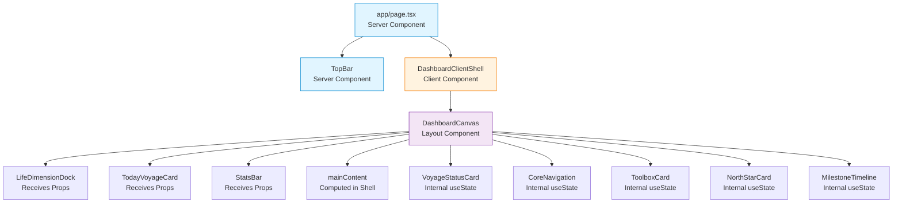

# LifeOS Architecture Documentation

## 📐 Component Architecture

### High-Level Structure

```
┌─────────────────────────────────────────────────────────────┐
│                    app/page.tsx                              │
│                  (Server Component)                          │
│  ┌────────────────────────────────────────────────────┐    │
│  │              TopBar (Server Component)              │    │
│  └────────────────────────────────────────────────────┘    │
│  ┌────────────────────────────────────────────────────┐    │
│  │      DashboardClientShell ('use client')            │    │
│  │  ┌──────────────────────────────────────────────┐  │    │
│  │  │  State: selectedDimensionId, taskStatus      │  │    │
│  │  │  (Both persisted via useLocalStorageState)   │  │    │
│  │  └──────────────────────────────────────────────┘  │    │
│  │  ┌──────────────────────────────────────────────┐  │    │
│  │  │      DashboardCanvas (Layout Component)      │  │    │
│  │  │  ┌────────────┐ ┌──────────┐ ┌────────────┐ │  │    │
│  │  │  │ Left Sidebar│ │  Center  │ │RightSidebar│ │  │    │
│  │  │  │            │ │          │ │            │ │  │    │
│  │  │  │VoyageStatus│ │HeroQuote │ │TodayVoyage │ │  │    │
│  │  │  │CoreNav     │ │LifeDimDk │ │NorthStar   │ │  │    │
│  │  │  │ToolboxCard │ │StatsBar  │ │Milestone   │ │  │    │
│  │  │  └────────────┘ └──────────┘ └────────────┘ │  │    │
│  │  └──────────────────────────────────────────────┘  │    │
│  └────────────────────────────────────────────────────┘    │
└─────────────────────────────────────────────────────────────┘
```

### Component Classification



**Legend:**
- 🔵 **Server Components** (Blue) — Rendered on server, no client JS
- 🟠 **Client Components** (Orange) — Hydrated on client, manages state
- 🟣 **Layout Components** (Purple) — Pure layout, no state

---

## 🔄 Data Flow Architecture

### State Management Layers

```
┌─────────────────────────────────────────────────────────┐
│  Layer 1: Server Component (app/page.tsx)               │
│  - No state                                              │
│  - Pure JSX rendering                                    │
└─────────────────────────────────────────────────────────┘
                           │
                           ▼
┌─────────────────────────────────────────────────────────┐
│  Layer 2: Client Shell (DashboardClientShell)           │
│  - State: selectedDimensionId, taskStatus               │
│  - Persistence: useLocalStorageState hook               │
│  - Computed: completedTaskCount, mainContent            │
│  - Distributes via props                                │
└─────────────────────────────────────────────────────────┘
                           │
                           ▼
┌─────────────────────────────────────────────────────────┐
│  Layer 3: Dashboard Components                          │
│  Type A: Receive props (3 components)                   │
│    - LifeDimensionDock, TodayVoyageCard, StatsBar       │
│  Type B: Internal useState (5 components)               │
│    - ToolboxCard, CoreNavigation, MilestoneTimeline,    │
│      NorthStarCard, VoyageStatusCard                    │
└─────────────────────────────────────────────────────────┘
                           │
                           ▼
┌─────────────────────────────────────────────────────────┐
│  Layer 4: Storage (lib/storage.ts)                      │
│  - safeGet<T>(key, fallback)                            │
│  - safeSet<T>(key, value)                               │
│  - safeRemove(key)                                       │
│  - SSR-safe with graceful fallback                      │
└─────────────────────────────────────────────────────────┘
                           │
                           ▼
┌─────────────────────────────────────────────────────────┐
│  Layer 5: Browser localStorage                          │
│  - lifeos:v1:taskStatus                                 │
│  - lifeos:v1:selectedDimensionId                        │
└─────────────────────────────────────────────────────────┘
```

### Cross-Component Linkage Flow

**Linkage 1: Dimension → Hero Quote**

```
User clicks dimension
    │
    ▼
LifeDimensionDock.onClick(dimensionId)
    │
    ▼
DashboardClientShell.handleDimensionSelect(dimensionId)
    │
    ▼
setSelectedDimensionId(dimensionId)  ──────► localStorage write
    │
    ▼
React re-renders
    │
    ├─► LifeDimensionDock (active state updated)
    │
    └─► mainContent (computed from selectedDimensionId)
            │
            ▼
        Hero Quote displays dimension content
```

**Linkage 2: Task → Stats Bar**

```
User checks task
    │
    ▼
TodayVoyageCard.onTaskToggle(taskId)
    │
    ▼
DashboardClientShell.handleTaskToggle(taskId)
    │
    ▼
setTaskStatus(prev => ({...prev, [taskId]: !prev[taskId]}))
    │
    ▼ (localStorage write)
    │
    ▼
React re-renders
    │
    ├─► TodayVoyageCard (checkbox updated)
    │
    └─► StatsBar (completedCount = computed from taskStatus)
            │
            ▼
        StatsBar displays "Today: X/Y"
```

---

## 💾 localStorage Persistence Architecture

### Hook Architecture: useLocalStorageState

```
┌─────────────────────────────────────────────────────────┐
│              useLocalStorageState<T>(key, initial)       │
│                                                          │
│  ┌──────────────────────────────────────────────────┐  │
│  │ Step 1: Initialize state with initialValue       │  │
│  │   const [state, setState] = useState(initial)    │  │
│  │   - SSR safe (no localStorage access)            │  │
│  │   - First CSR render matches SSR HTML            │  │
│  └──────────────────────────────────────────────────┘  │
│                          │                               │
│                          ▼                               │
│  ┌──────────────────────────────────────────────────┐  │
│  │ Step 2: useEffect on mount                       │  │
│  │   if (isFirstMount.current) {                    │  │
│  │     queueMicrotask(() => {                       │  │
│  │       const stored = safeGet(key, initial)       │  │
│  │       setState(stored)                           │  │
│  │       isHydrated.current = true                  │  │
│  │     })                                            │  │
│  │   }                                               │  │
│  │   - queueMicrotask: bypasses React 19 lint rule  │  │
│  │   - isHydrated ref: prevents initial overwrite   │  │
│  └──────────────────────────────────────────────────┘  │
│                          │                               │
│                          ▼                               │
│  ┌──────────────────────────────────────────────────┐  │
│  │ Step 3: setStateAndStorage callback              │  │
│  │   (action) => {                                  │  │
│  │     setState((prev) => {                         │  │
│  │       const next = compute(action, prev)         │  │
│  │       if (isHydrated.current) {                  │  │
│  │         safeSet(key, next)                       │  │
│  │       }                                           │  │
│  │       return next                                 │  │
│  │     })                                            │  │
│  │   }                                               │  │
│  │   - Only writes after hydration complete         │  │
│  │   - Atomic state + storage update                │  │
│  └──────────────────────────────────────────────────┘  │
└─────────────────────────────────────────────────────────┘
```

### Lifecycle Timeline

```
Server Render        Client Hydration        Post-Hydration
     │                     │                       │
     ▼                     ▼                       ▼
┌─────────┐         ┌─────────────┐          ┌──────────┐
│ initial │   ───►  │   initial   │   ───►   │  stored  │
│  value  │         │  (matches)  │          │  value   │
└─────────┘         └─────────────┘          └──────────┘
                          │                        │
                          ▼                        ▼
                  No hydration              User interactions
                    mismatch               trigger writes
```

### Storage Module: lib/storage.ts

```typescript
// SSR-safe primitive operations

export function safeGet<T>(key: string, fallback: T): T {
  if (typeof window === 'undefined') return fallback;  // SSR guard
  try {
    const item = window.localStorage.getItem(key);
    if (item === null) return fallback;
    return JSON.parse(item) as T;
  } catch {
    return fallback;  // JSON corruption / privacy mode
  }
}

export function safeSet<T>(key: string, value: T): void {
  if (typeof window === 'undefined') return;  // SSR no-op
  try {
    window.localStorage.setItem(key, JSON.stringify(value));
  } catch {
    // Quota exceeded / privacy mode — fail silently
  }
}
```

**Edge Cases Handled:**
- ✅ Server-side rendering (no `window` object)
- ✅ Privacy mode (localStorage throws on access)
- ✅ Quota exceeded (write fails gracefully)
- ✅ JSON corruption (parse falls back to default)
- ✅ Disabled localStorage (silent failure)

---

## 🏛️ Key Technical Decisions

### Decision 1: Server Component Preservation

**Question:** Should `app/page.tsx` be a Client Component for state management?

**Decision:** Keep `app/page.tsx` as a Server Component. Introduce `DashboardClientShell` as the Client boundary.

**Rationale:**
- Preserves Next.js best practices
- Enables future async data fetching (e.g., `await fetchUserData()`)
- Allows metadata export (`export const metadata`)
- Reduces Client JS bundle size
- Single Client boundary is easier to reason about

**Alternatives Considered:**

| Option | Pros | Cons |
|--------|------|------|
| A: `'use client'` on page.tsx | Simple state management | Architectural regression |
| B: Client Shell pattern (chosen) | Server Component preserved | Slightly more complex |
| C: React Context | Standard pattern | Premature for 2 states |

---

### Decision 2: No Global State Library

**Question:** Should we use Zustand or Redux for state management?

**Decision:** No global state library. Use Client Shell + props.

**Rationale:**
- Only 2 cross-component states (selectedDimensionId, taskStatus)
- Zustand/Redux would add 10+ KB bundle size
- Props are explicit and easier to trace
- Can introduce Zustand later if state count grows

**Threshold for Reconsideration:**
- 5+ cross-component states
- 3+ levels of prop drilling
- Need for time-travel debugging

---

### Decision 3: queueMicrotask for React 19 Compliance

**Question:** How to set state inside useEffect without violating React 19's lint rules?

**Decision:** Use `queueMicrotask` to defer setState to the next microtask.

**Rationale:**
- React 19 added `react-hooks/set-state-in-effect` rule
- Direct setState in useEffect triggers warning
- `queueMicrotask` defers execution after useEffect completes
- More reliable than `setTimeout(fn, 0)` (microtask vs macrotask)

**Code Pattern:**

```typescript
useEffect(() => {
  if (isFirstMount.current) {
    isFirstMount.current = false;
    queueMicrotask(() => {
      const stored = safeGet(key, initialValue);
      setState(stored);  // No lint warning
      isHydrated.current = true;
    });
  }
}, [key]);
```

---

### Decision 4: Intentional Dependency Omission

**Question:** Should `initialValue` be in the useEffect dependency array?

**Decision:** Omit `initialValue` from dependencies.

**Rationale:**
- `initialValue` like `defaultTaskStatus` is recreated on every render (new reference)
- Including it would re-trigger effect on every render
- localStorage is the single source of truth, doesn't need to react to `initialValue` changes
- Documented with `// eslint-disable-next-line react-hooks/exhaustive-deps`

**Risk Mitigation:**
- Comment explains the intentional omission
- `initialValue` is statically defined, never changes at runtime
- If future use case requires reactive `initialValue`, this assumption can be revisited

---

### Decision 5: Storage Key Versioning

**Question:** How to handle future schema migrations?

**Decision:** Prefix all keys with `lifeos:v1:` namespace.

**Rationale:**
- Allows future schema migration (`v1` → `v2`)
- Prevents collision with other apps on same domain
- Enables bulk key management (e.g., "clear all v1 data")
- Standard practice in localStorage usage

**Naming Convention:**
```
lifeos:v1:taskStatus
lifeos:v1:selectedDimensionId
└─────┬───┘ └────────┬────────┘
   namespace      state name
```

---

## 📦 Module Dependencies

### Dependency Graph

```
app/page.tsx
    │
    └─► components/layout/DashboardClientShell.tsx
            │
            ├─► lib/useLocalStorageState.ts
            │       │
            │       └─► lib/storage.ts
            │
            ├─► components/layout/DashboardCanvas.tsx
            │
            ├─► components/dashboard/LifeDimensionDock.tsx
            ├─► components/dashboard/TodayVoyageCard.tsx
            ├─► components/dashboard/StatsBar.tsx
            ├─► components/dashboard/VoyageStatusCard.tsx
            ├─► components/dashboard/CoreNavigation.tsx
            ├─► components/dashboard/ToolboxCard.tsx
            ├─► components/dashboard/NorthStarCard.tsx
            ├─► components/dashboard/MilestoneTimeline.tsx
            │
            ├─► data/mockLifeData.ts
            └─► types/lifeos.ts
```

### External Dependencies (Production)

```
next ──────────────► 16.2.6
react ─────────────► 19.2.4
react-dom ─────────► 19.2.4
typescript ────────► 5.x
tailwindcss ───────► 3.x
```

**Total Production Dependencies:** Minimal (Next.js + React + Tailwind only)

**Phase 3 + Phase 4.1 New Dependencies:** 0

---

## 🔐 Architectural Constraints

### Hard Rules (Never Violate)

1. ❌ **Never** add `'use client'` to `app/page.tsx`
2. ❌ **Never** modify Design Tokens (globals.css lines 1-53)
3. ❌ **Never** add new dependencies without approval
4. ❌ **Never** introduce global state library (Zustand/Redux/MobX)
5. ❌ **Never** modify existing CSS rules (only append at end)

### Soft Guidelines (Default Behavior)

1. ✅ Cross-component state → Client Shell + props
2. ✅ Component-internal state → useState
3. ✅ Persistence → useLocalStorageState hook
4. ✅ Each feature → 1 atomic commit
5. ✅ Pre-commit → npm run lint && npm run build

### Escape Hatches (Conditions for Reconsideration)

| Constraint | Conditions to Reconsider |
|------------|--------------------------|
| No Context | 5+ cross-component states OR 3+ levels of prop drilling |
| No Global Store | Time-travel debugging needed OR async state updates |
| No New Deps | Critical functionality not achievable with current stack |
| Server Component | Async user-specific data needed at page level |

---

## 🎯 Architecture Quality Metrics

| Metric | Target | Actual |
|--------|--------|--------|
| Server Component Preservation | 100% | ✅ 100% |
| Client Boundary Count | 1 | ✅ 1 (DashboardClientShell) |
| Global State Stores | 0 | ✅ 0 |
| New Dependencies (Phase 3+4.1) | 0 | ✅ 0 |
| Cross-Component Linkages | 2 | ✅ 2 |
| Persisted States | 2 | ✅ 2 |
| Hydration Warnings | 0 | ✅ 0 |
| TypeScript Errors | 0 | ✅ 0 |
| ESLint Warnings | 0 | ✅ 0 |

---

**This architecture demonstrates engineering discipline: minimal complexity, clear boundaries, and zero unnecessary abstractions.**
